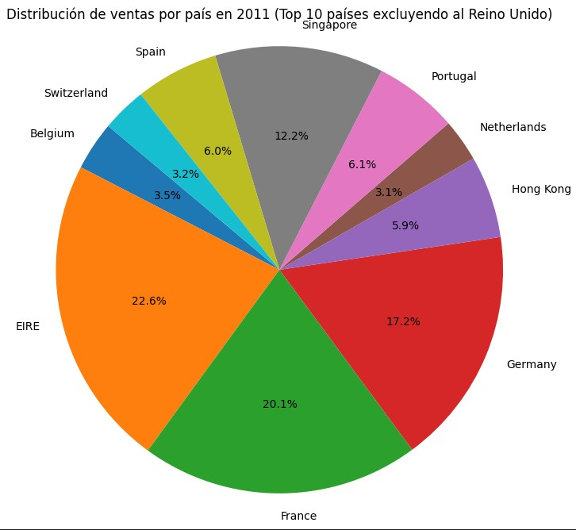
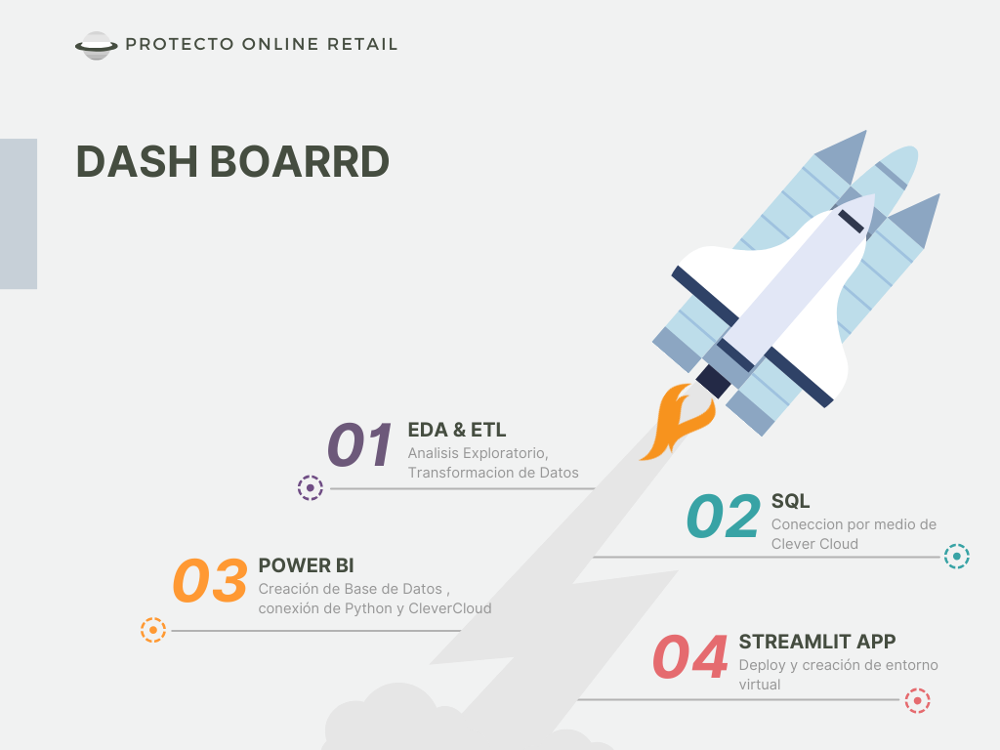
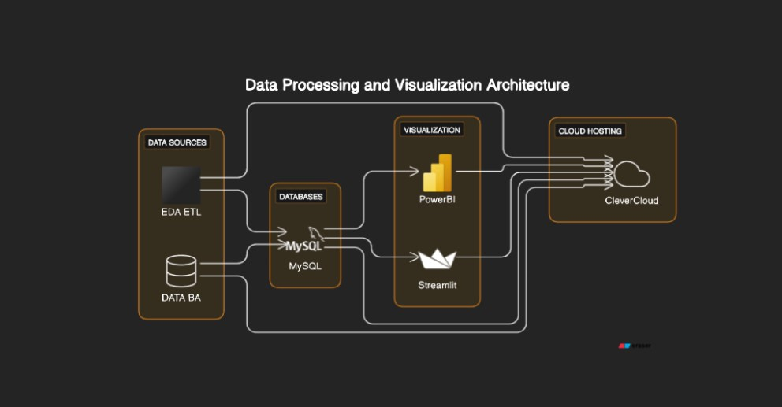

Problem Statement::
The CEO and CMO have recently met to finalise the requirements and would like you to provide them with some analysis and visuals that would help answer their questions.
Both, the executives are interested in viewing and understanding how they can use the data to make more meaningful decisions. You would need to provide insights which 
they can use to create the expansion strategy. The executives want to analyse the trends and the breakdown by different categories so that they have clarity on how the
revenue is being generated and what are the main factors affecting the online store.

**2. Data Engineering(ETL y API)**  

- **2.1 *Data Transformations and Explorations:***  

I performed essential transformations to load the datasets in the proper format. These transformations were carried out with the purpose of optimizing both the performance of the data in the dashboard.  
  +   [ETL](1_ETL_EDA/ETL_EDA.ipynb) Contains ETL & EDA notebook

1))
The CEO of the retail store is interested to view the time series of the revenue data for the year 2011 only. He would like to view granular data by looking into revenue
for each month. The CEO is interested in viewing the seasonal trends and wants to dig deeper into why these trends occur. This analysis will be helpful for the CEO to forecast for the next year.

2))
The CMO is interested in viewing the top 10 countries which are generating the highest revenue. Additionally, the CMO is also interested in viewing the quantity sold along with the 
revenue generated. The CMO does not want to have the United Kingdom in this visual.

3))
The CMO of the online retail store wants to view the information on the top 10 customers by revenue. He is interested in a visual that shows the greatest revenue generating 
customer at the start and gradually declines to the lower revenue generating customers. The CMO wants to target the higher revenue generating customers and ensure that they 
remain satisfied with their products.

4))
The CEO is looking to gain insights on the demand for their products. He wants to look at all countries and see which regions have the greatest demand for their products.
Once the CEO gets an idea of the regions that have high demand ?

Last Step:

  

## Autor:    

  
   
  Karina Kozlowski 
   
  <a href="https://www.linkedin.com/in/karina-kozlowski-625535217/" target="_blank">
    

